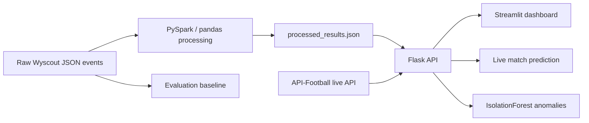

# Football BDA

Football BDA is a football analytics project that combines batch data processing, live football API integration, anomaly detection, and a lightweight match-outcome evaluation baseline. The repository ships a Streamlit dashboard, a Flask backend, PySpark processing jobs, and raw Wyscout event data for European Championship and World Cup matches.

## Project Overview

The codebase supports five main capabilities:

* Data analytics for team and player comparisons.
* Data engineering with PySpark-based event aggregation.
* Statistical prediction for fixture outcomes using processed team signals and live API context.
* Machine learning for team anomaly detection with IsolationForest.
* Interactive reporting through a Streamlit frontend.

## Architecture



### Main components

* `backend/api/app.py` exposes the Flask API used by the frontend and clients.
* `backend/services/analytics_service.py` provides team and player analytics.
* `backend/services/ml_service.py` contains the IsolationForest anomaly detector.
* `backend/services/live_prediction_service.py` combines processed team data with live API context for fixture prediction.
* `backend/spark_jobs/data_processor.py` and `process_data.py` aggregate event data into summary artifacts.
* `frontend/` contains the Streamlit dashboard and page-level views.

## Does the Project Contain These Capabilities?

* Machine Learning: yes. The project uses IsolationForest for anomaly detection.
* Statistical Prediction: yes. The live match prediction service combines processed football signals with live context to estimate outcomes.
* Anomaly Detection: yes. Team anomaly detection is implemented in the backend and exposed through the API and frontend.
* Data Analytics: yes. Team rankings, comparisons, player comparisons, and live football summaries are analytics workflows.
* Data Engineering: yes. The Spark job processes raw event data into reusable summaries.

## Datasets

The repository currently includes the following datasets and derived artifacts.

| Dataset | Rows | Features | Source / Notes |
| --- | ---: | ---: | --- |
| `data/events_European_Championship.json` | 78,140 | 12 | Wyscout event logs for European Championship matches |
| `data/events_World_Cup.json` | 101,759 | 12 | Wyscout event logs for World Cup matches |
| `data/players.json` | 3,603 | 14 | Wyscout player metadata |
| `data/teams.json` | 142 | 6 | Wyscout team metadata |
| `data/processed_results.json` | Derived | Derived | Aggregated summary produced by the processing job; contains `teams`, `players`, `team_stats`, `total_rows`, and `total_columns` |

### Derived artifact details

`data/processed_results.json` is not a flat table. It currently contains:

* `teams`: 40 entries
* `players`: 1,055 entries
* `team_stats`: 10 entries
* `total_rows`: 179,899 raw event rows across both event files
* `total_columns`: 12 raw event columns

## Technologies Used

* Python
* Flask
* Streamlit
* PySpark
* pandas
* scikit-learn
* requests
* Docker / Docker Compose
* API-Football for live fixtures, standings, and team stats

## Model Details

### Anomaly Detection

`backend/services/ml_service.py` trains an IsolationForest on aggregated team statistics. It uses team-level features such as shots, passes, fouls, total events, and matches to flag outliers.

### Live Match Prediction

`backend/services/live_prediction_service.py` is a heuristic predictor, not a trained supervised model. It blends:

* processed historical team stats from `data/processed_results.json`
* live standings and team statistics from API-Football

### Evaluation Baseline

The repository now includes a reproducible evaluation pipeline in `backend/services/evaluation_service.py` and `evaluate_models.py`.

Evaluation design:

* Match-level rows are built from the two raw event datasets.
* Final labels are derived from goal events in the raw logs.
* Features use first-half event-count differentials between the two teams in each match.
* A 75/25 train/test split is used with `random_state=42`.
* The classification baseline uses `RandomForestClassifier` for match outcome.
* The regression baseline uses `RandomForestRegressor` for goal difference.

The report is written to `data/model_evaluation.json`.

## Evaluation Metrics

### Classification metrics

| Metric | Value |
| --- | ---: |
| Accuracy | 0.379310 |
| Precision (macro) | 0.345238 |
| Recall (macro) | 0.345238 |
| F1 Score (macro) | 0.345238 |
| ROC-AUC (ovr, macro) | 0.549874 |

### Regression metrics

| Metric | Value |
| --- | ---: |
| MAE | 1.349540 |
| RMSE | 1.638841 |
| R² | -0.078681 |

These values were computed by running `python evaluate_models.py` in the repository root.

## Results

The current baseline is intentionally simple and reproducible. It demonstrates that the raw event data can be converted into a supervised evaluation dataset, but the regression score and R² indicate that there is room for improvement in the feature set and model choice.

The anomaly detector and live prediction path remain available as separate capabilities. The evaluation pipeline does not modify production API behavior.

## Reproduce the Evaluation

```bash
python evaluate_models.py
```

The generated report is saved to `data/model_evaluation.json`.

## Running the Project

### Local development

```bash
pip install -r requirements.txt
python backend/api/app.py
```

### PySpark processing

```bash
python backend/spark_jobs/data_processor.py
```

### Docker

```bash
docker-compose up --build
```

## Future Improvements

* Replace the baseline random forest models with stronger football-specific feature engineering.
* Add time-aware cross-validation and calibration checks.
* Expand evaluation to separate home/away or team-strength prediction tasks.
* Persist more processed features from the raw event logs.
* Add automated tests for the evaluation pipeline and data processing jobs.
* Replace heuristic live prediction logic with a trained supervised model if reliable labels become available.
